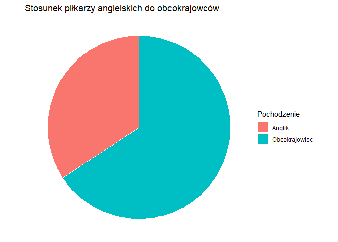
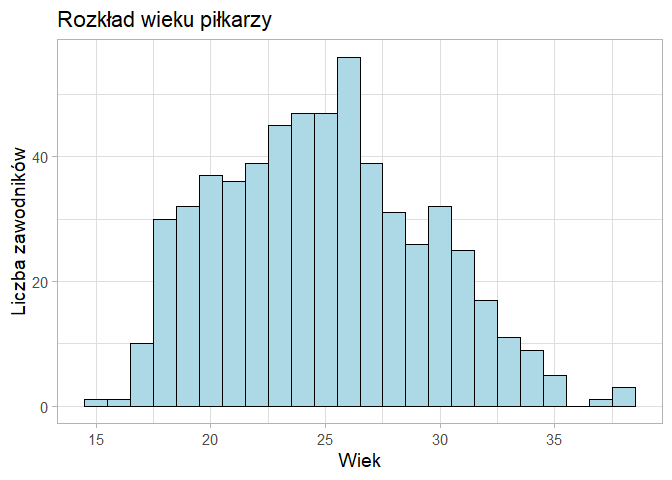
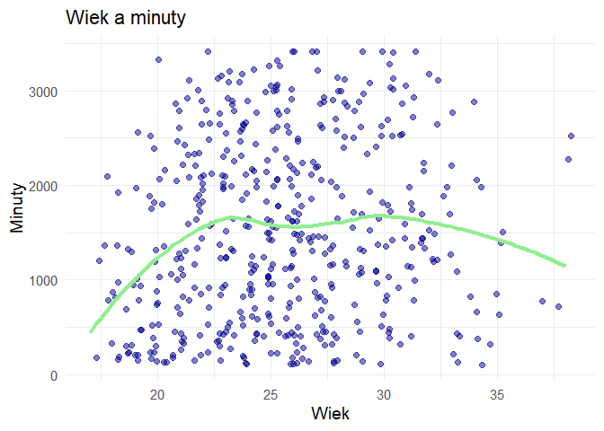
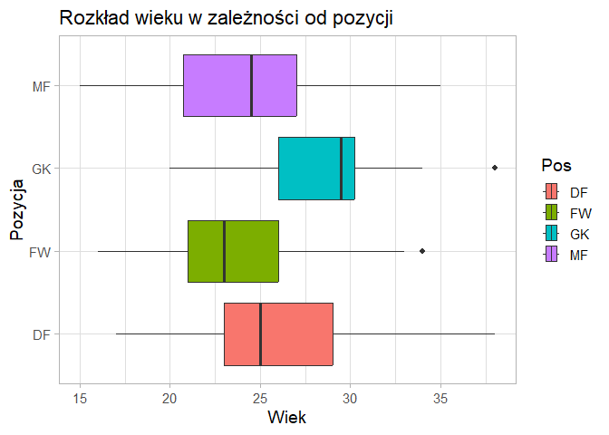
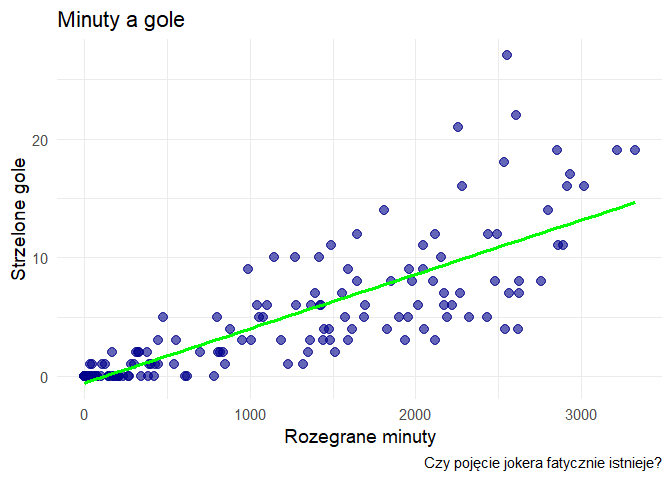
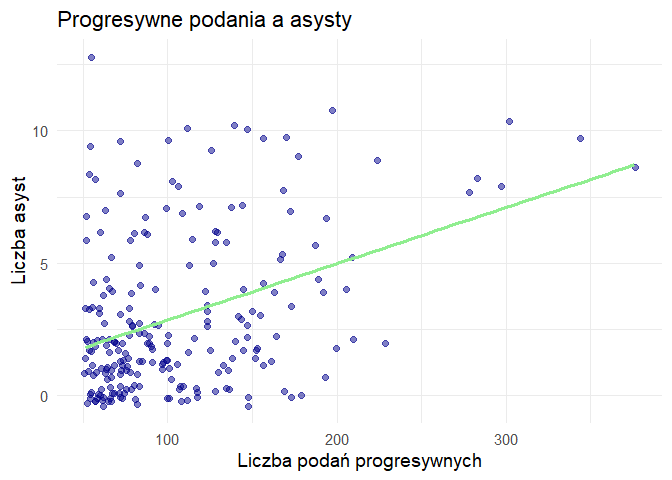
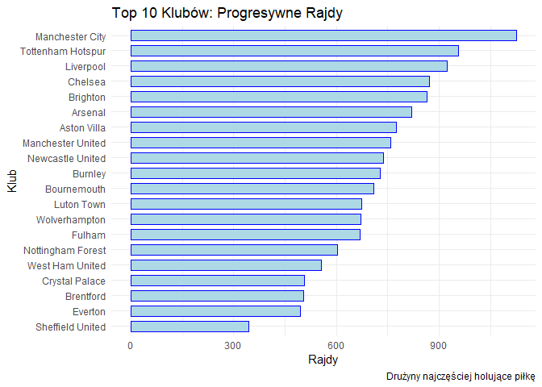
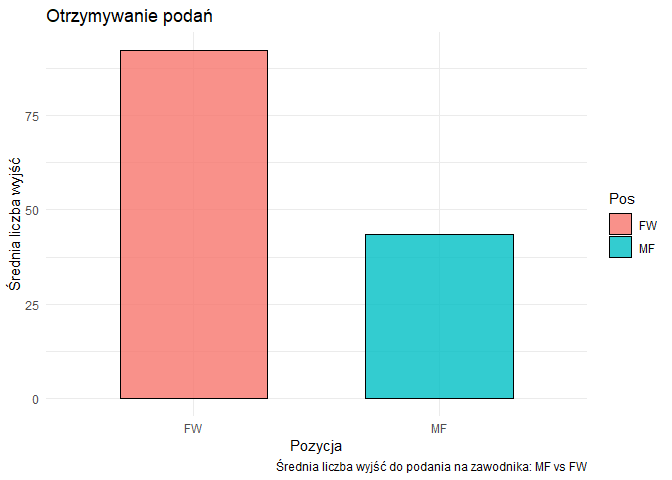
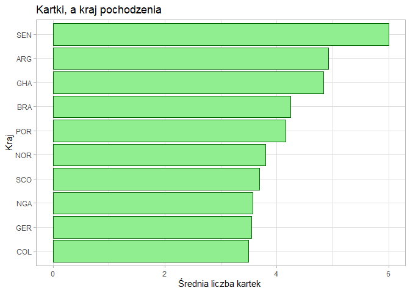
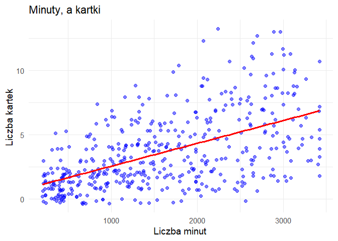

Analiza Premier League
================
Adam Marko

Liga angielska jest uważana przez wielu za najlepszą ligę na świecie.
Aktualnie dysponuje ona największym budżetem, a kluby ze środka stawki
bardzo się umocniły i stawiają duży opór najlepszym w lidze. Jako stały
widz Premier League, postanowiłem wziąć pod lupę dane z sezonu 23/24 i
przeanalizować statystyki poszczególnych piłkarzy. Dane zawierają wiele
parametrów, o których opowiem w dalszej części projektu.

## CZYSZCZENIE DANYCH

### Zapoznanie z danymi

``` r
dane <- read.csv("PLSTATS.CSV")
head(dane)
```

    ##           Player  Nation   Pos Age MP Starts  Min X90s Gls Ast G.A G.PK PK
    ## 1          Rodri  es ESP    MF  27 34     34 2931 32.6   8   9  17    8  0
    ## 2     Phil Foden eng ENG FW,MF  23 35     33 2857 31.7  19   8  27   19  0
    ## 3        Ederson  br BRA    GK  29 33     33 2785 30.9   0   0   0    0  0
    ## 4 Julián Álvarez  ar ARG MF,FW  23 36     31 2647 29.4  11   8  19    9  2
    ## 5    Kyle Walker eng ENG    DF  33 32     30 2767 30.7   0   4   4    0  0
    ## 6 Bernardo Silva  pt POR MF,FW  28 33     29 2578 28.6   6   9  15    6  0
    ##   PKatt CrdY CrdR   xG npxG xAG npxG.xAG PrgC PrgP PrgR Gls_90 Ast_90 G.A_90
    ## 1     0    8    1  4.1  4.1 3.9      8.0   76  376   55   0.25   0.28   0.52
    ## 2     0    2    0 10.3 10.3 8.4     18.7   93  168  269   0.60   0.25   0.85
    ## 3     0    5    0  0.0  0.0 0.1      0.1    0    4    0   0.00   0.00   0.00
    ## 4     2    2    0 13.0 11.5 6.4     17.9   64  103  180   0.37   0.27   0.65
    ## 5     0    2    0  0.4  0.4 2.6      3.0   74  157  172   0.00   0.13   0.13
    ## 6     0    8    0  3.7  3.7 7.6     11.3  140  177  260   0.21   0.31   0.52
    ##   G.PK_90 G.A.PK_90 xG_90 xAG_90 xG.xAG_90 npxG_90 npxG.xAG_90            Team
    ## 1    0.25      0.52  0.12   0.12      0.24    0.12        0.24 Manchester City
    ## 2    0.60      0.85  0.33   0.26      0.59    0.33        0.59 Manchester City
    ## 3    0.00      0.00  0.00   0.00      0.00    0.00        0.00 Manchester City
    ## 4    0.31      0.58  0.44   0.22      0.66    0.39        0.61 Manchester City
    ## 5    0.00      0.13  0.01   0.09      0.10    0.01        0.10 Manchester City
    ## 6    0.21      0.52  0.13   0.27      0.40    0.13        0.40 Manchester City

``` r
str(dane)
```

    ## 'data.frame':    580 obs. of  34 variables:
    ##  $ Player     : chr  "Rodri" "Phil Foden" "Ederson" "Julián Álvarez" ...
    ##  $ Nation     : chr  "es ESP" "eng ENG" "br BRA" "ar ARG" ...
    ##  $ Pos        : chr  "MF" "FW,MF" "GK" "MF,FW" ...
    ##  $ Age        : num  27 23 29 23 33 28 23 26 28 21 ...
    ##  $ MP         : int  34 35 33 36 32 33 31 30 30 28 ...
    ##  $ Starts     : int  34 33 33 31 30 29 29 28 28 26 ...
    ##  $ Min        : num  2931 2857 2785 2647 2767 ...
    ##  $ X90s       : num  32.6 31.7 30.9 29.4 30.7 28.6 28.4 28.4 27.9 25.9 ...
    ##  $ Gls        : num  8 19 0 11 0 6 27 0 2 4 ...
    ##  $ Ast        : num  9 8 0 8 4 9 5 0 0 1 ...
    ##  $ G.A        : num  17 27 0 19 4 15 32 0 2 5 ...
    ##  $ G.PK       : num  8 19 0 9 0 6 20 0 2 4 ...
    ##  $ PK         : num  0 0 0 2 0 0 7 0 0 0 ...
    ##  $ PKatt      : num  0 0 0 2 0 0 8 0 0 0 ...
    ##  $ CrdY       : num  8 2 5 2 2 8 1 0 4 3 ...
    ##  $ CrdR       : num  1 0 0 0 0 0 0 0 1 0 ...
    ##  $ xG         : num  4.1 10.3 0 13 0.4 3.7 29.2 1.4 1.9 3.1 ...
    ##  $ npxG       : num  4.1 10.3 0 11.5 0.4 3.7 22.9 1.4 1.9 3.1 ...
    ##  $ xAG        : num  3.9 8.4 0.1 6.4 2.6 7.6 4.3 0.3 0.5 1.4 ...
    ##  $ npxG.xAG   : num  8 18.7 0.1 17.9 3 11.3 27.2 1.7 2.4 4.5 ...
    ##  $ PrgC       : num  76 93 0 64 74 140 35 34 46 63 ...
    ##  $ PrgP       : num  376 168 4 103 157 177 26 173 148 136 ...
    ##  $ PrgR       : num  55 269 0 180 172 260 126 16 36 115 ...
    ##  $ Gls_90     : num  0.25 0.6 0 0.37 0 0.21 0.95 0 0.07 0.15 ...
    ##  $ Ast_90     : num  0.28 0.25 0 0.27 0.13 0.31 0.18 0 0 0.04 ...
    ##  $ G.A_90     : num  0.52 0.85 0 0.65 0.13 0.52 1.13 0 0.07 0.19 ...
    ##  $ G.PK_90    : num  0.25 0.6 0 0.31 0 0.21 0.71 0 0.07 0.15 ...
    ##  $ G.A.PK_90  : num  0.52 0.85 0 0.58 0.13 0.52 0.88 0 0.07 0.19 ...
    ##  $ xG_90      : num  0.12 0.33 0 0.44 0.01 0.13 1.03 0.05 0.07 0.12 ...
    ##  $ xAG_90     : num  0.12 0.26 0 0.22 0.09 0.27 0.15 0.01 0.02 0.06 ...
    ##  $ xG.xAG_90  : num  0.24 0.59 0 0.66 0.1 0.4 1.18 0.06 0.09 0.18 ...
    ##  $ npxG_90    : num  0.12 0.33 0 0.39 0.01 0.13 0.81 0.05 0.07 0.12 ...
    ##  $ npxG.xAG_90: num  0.24 0.59 0 0.61 0.1 0.4 0.96 0.06 0.09 0.18 ...
    ##  $ Team       : chr  "Manchester City" "Manchester City" "Manchester City" "Manchester City" ...

Dane przedstawiają szczegółowe statystyki zawodników z całego sezonu
2023/2024. Na początku tabeli znajdziemy podstawowe informacje: imię i
nazwisko piłkarza, jego narodowość oraz pozycję na boisku (są to zmienne
tekstowe). Następne kolumny to już dane liczbowe, które zawierają
informacje o wieku, golach, asystach czy zagranych meczach. Końcową
część danych stanowią bardziej zaawansowane przeliczniki oczekiwanych
goli/asyst, przeliczenia goli/asyst na 90 minut oraz wiele więcej.
Dokładniejszą analizą i wytłumaczeniem, co dokładnie oznaczają, zajmę
się w dalszej części projektu.

Przejdźmy do porządkowania danych. Aby wykorzystać funkcje z zestawu
tidyr, możemy zauważyć, że Kraj pochodzenia zawiera zbędne powtórzenie
`es ESP`. Nie potrzebujemy podwojonego skrótu kraju więc usuniemy to za
pomocą funkcji `separate`.

### Czyszczenie danych cz1

``` r
library(tidyr)
library(dplyr)
library(ggplot2)
head(dane$Nation)
```

    ## [1] "es ESP"  "eng ENG" "br BRA"  "ar ARG"  "eng ENG" "pt POR"

``` r
dane<-dane %>%
  separate(Nation, into = c("kosz", "Nation"), sep = " ")%>%
  select(-kosz)
  


head(dane)
```

    ##           Player Nation   Pos Age MP Starts  Min X90s Gls Ast G.A G.PK PK PKatt
    ## 1          Rodri    ESP    MF  27 34     34 2931 32.6   8   9  17    8  0     0
    ## 2     Phil Foden    ENG FW,MF  23 35     33 2857 31.7  19   8  27   19  0     0
    ## 3        Ederson    BRA    GK  29 33     33 2785 30.9   0   0   0    0  0     0
    ## 4 Julián Álvarez    ARG MF,FW  23 36     31 2647 29.4  11   8  19    9  2     2
    ## 5    Kyle Walker    ENG    DF  33 32     30 2767 30.7   0   4   4    0  0     0
    ## 6 Bernardo Silva    POR MF,FW  28 33     29 2578 28.6   6   9  15    6  0     0
    ##   CrdY CrdR   xG npxG xAG npxG.xAG PrgC PrgP PrgR Gls_90 Ast_90 G.A_90 G.PK_90
    ## 1    8    1  4.1  4.1 3.9      8.0   76  376   55   0.25   0.28   0.52    0.25
    ## 2    2    0 10.3 10.3 8.4     18.7   93  168  269   0.60   0.25   0.85    0.60
    ## 3    5    0  0.0  0.0 0.1      0.1    0    4    0   0.00   0.00   0.00    0.00
    ## 4    2    0 13.0 11.5 6.4     17.9   64  103  180   0.37   0.27   0.65    0.31
    ## 5    2    0  0.4  0.4 2.6      3.0   74  157  172   0.00   0.13   0.13    0.00
    ## 6    8    0  3.7  3.7 7.6     11.3  140  177  260   0.21   0.31   0.52    0.21
    ##   G.A.PK_90 xG_90 xAG_90 xG.xAG_90 npxG_90 npxG.xAG_90            Team
    ## 1      0.52  0.12   0.12      0.24    0.12        0.24 Manchester City
    ## 2      0.85  0.33   0.26      0.59    0.33        0.59 Manchester City
    ## 3      0.00  0.00   0.00      0.00    0.00        0.00 Manchester City
    ## 4      0.58  0.44   0.22      0.66    0.39        0.61 Manchester City
    ## 5      0.13  0.01   0.09      0.10    0.01        0.10 Manchester City
    ## 6      0.52  0.13   0.27      0.40    0.13        0.40 Manchester City

Skutecznie rozdzieliliśmy podwójny skrót. Rozważałem również
rozdzielenie kolumny `Player`, ale zrezygnowałem z tego pomysłu ze
względu na sporą ilość zawodników z np. Brazylii, którzy posługują się
jednoczłonowym przydomkiem.

Następnie skupmy się na statystykach specjalistycznych. W mojej analizie
ostatecznie nie zdecydowałem się użyć danych z drugiej części tabeli. Są
to dane, które głównie przeliczają gole i asysty na 90 minut, a to nie
było potrzebne w mojej analizie.

### Czyszczenie danych cz2

``` r
dane <- dane %>%
  select(-c( G.A_90, G.PK_90, G.A.PK_90, xG.xAG_90, npxG.xAG_90, X90s, npxG.xAG, xG_90, xAG_90, npxG_90 ))
head(dane)
```

    ##           Player Nation   Pos Age MP Starts  Min Gls Ast G.A G.PK PK PKatt CrdY
    ## 1          Rodri    ESP    MF  27 34     34 2931   8   9  17    8  0     0    8
    ## 2     Phil Foden    ENG FW,MF  23 35     33 2857  19   8  27   19  0     0    2
    ## 3        Ederson    BRA    GK  29 33     33 2785   0   0   0    0  0     0    5
    ## 4 Julián Álvarez    ARG MF,FW  23 36     31 2647  11   8  19    9  2     2    2
    ## 5    Kyle Walker    ENG    DF  33 32     30 2767   0   4   4    0  0     0    2
    ## 6 Bernardo Silva    POR MF,FW  28 33     29 2578   6   9  15    6  0     0    8
    ##   CrdR   xG npxG xAG PrgC PrgP PrgR Gls_90 Ast_90            Team
    ## 1    1  4.1  4.1 3.9   76  376   55   0.25   0.28 Manchester City
    ## 2    0 10.3 10.3 8.4   93  168  269   0.60   0.25 Manchester City
    ## 3    0  0.0  0.0 0.1    0    4    0   0.00   0.00 Manchester City
    ## 4    0 13.0 11.5 6.4   64  103  180   0.37   0.27 Manchester City
    ## 5    0  0.4  0.4 2.6   74  157  172   0.00   0.13 Manchester City
    ## 6    0  3.7  3.7 7.6  140  177  260   0.21   0.31 Manchester City

W trakcie analizy często pojawiał mi się problem w kolumnie Pos, gracze
którzy mieli 2 pozycje byli problematyczni i trzeba było usuwać pozycje
poboczną. Z racji tego, że pierwsza w kolejności jest pozycją główną, od
razu usuwamy pozycję poboczną aby uniknąć niepotrzenych komplikacji

``` r
dane <- dane %>%
  separate(Pos, into = c("Pos", "Smieci"), sep = ",", extra = "drop", fill = "right") %>%
  select(-Smieci) %>%
  filter(Pos %in% c("GK", "DF", "MF", "FW"))
```

Ostatnim aspektem wymagającym uwagi są podwojone rekordy piłkarzy,
którzy w trakcie sezonu zmienili barwy klubowe. Dobrym przykładem jest
Cole Palmer, który posiada rekord w Manchesterze City (rozegrał tam
zaledwie 11 minut), po czym został wytransferowany do Chelsea, dla
której zdobył 22 gole. Po przemyleniu, nie usuwam duplikatów z 2
powodów: w Premier League transferów wewnątrz ligi w połowie sezonu jest
mało. Zachowanie obu rekordów pozwala na rzetelną analizę wyników
poszczególnych klubów. W przypadku analizy indywidualnych osiągnięć
zastosujemy funkcję agregującą, która zsumuje wyniki zawodnika z obu
drużyn.

<br>

## ANALIZA DEMOGRAFICZNA

W tym punkcie weźmiemy pod lupe kraj pochodzenia zawodników i odpowiemy
na pytania:

- 1.Jak liczbowo rozkłada się podział na kraje

- 2.Jaki procent wszystkich graczy to gracze z Anglii  
  <br>

``` r
top_kraje <- dane %>%
  count(Nation) %>%       
  arrange(desc(n)) %>%     
  top_n(10, n)

top_kraje
```

    ##    Nation   n
    ## 1     ENG 199
    ## 2     BRA  33
    ## 3     FRA  28
    ## 4     ESP  20
    ## 5     NED  19
    ## 6     POR  19
    ## 7     IRL  17
    ## 8     BEL  16
    ## 9     SCO  16
    ## 10    ARG  14
    ## 11    WAL  14

``` r
dane_kraj_kolo <- dane %>%
  mutate(Pochodzenie = ifelse(Nation == "ENG", "Anglik", "Obcokrajowiec")) %>%
  count(Pochodzenie) %>%
  mutate(procent = round(n / sum(n) * 100, 2)) 

dane_kraj_kolo
```

    ##     Pochodzenie   n procent
    ## 1        Anglik 199   34.31
    ## 2 Obcokrajowiec 381   65.69

``` r
ggplot(dane_kraj_kolo, aes(x = "", y = n, fill = Pochodzenie)) +
  geom_bar(stat = "identity", width = 1, color = "white") +

 
  
  coord_polar("y", start = 0) +
  
  theme_void() +
  
  labs(title = "Stosunek piłkarzy angielskich do obcokrajowców",
       fill = "Pochodzenie")
```

<!-- -->

Widzimy, że stosunek wynosi 65% do 35% na korzyść obcokrajowców. Można
postawić sobie pytanie, czy zawodnicy importowani stanowią dużą część
ligi. Moim zdaniem, z racji na pozycję angielskiej Premier League,
powinni stanowić duży procent, bo najlepsze kluby powinny być otwarte na
talenty spoza własnego kraju. W celu weryfikacji sprawdzamy w internecie
dane z hiszpańskiej ligi: *W sezonie 2023/24 piłkarze spoza Hiszpanii
(obcokrajowcy) stanowili około 44% wszystkich zawodników zgłoszonych do
rozgrywek La Liga.* Owe informacje, przy założeniu, że są prawdziwe,
potwierdzają moją tezę. <br>

## ANALIZA WIEKU

Kolejnym punktem naszej analizy będzie struktura wieku zawodników.
Pytanie, które sobie stawiam, brzmi: czy popularna narracja o szkoleniu
młodzieży ma faktyczne przełożenie na występy w najwyższej lidze? Co
więcej, porównamy uzyskane wyniki z danymi z ligi hiszpańskiej oraz z
Premier League sprzed 20 lat. Dodatkowo przejrzymy wykresy, które
powiedzą nam o rozkładzie wieku w zależności od pozycji. <br>

### Średni wiek i mediana

``` r
dane %>%
  summarise(sr_wiek = round(mean(Age, na.rm = TRUE), 2),
            med_wiek = round(median(Age, na.rm = T), 2)
            ) 
```

    ##   sr_wiek med_wiek
    ## 1   24.91       25

Wynik oscyluje w okolicach 25. Na pierwszy rzut oka stwierdzam, że
świadczy to o sporym udziale młodych w strukturach ligi, ale aby to
potwierdzić przytocze jeszcze dane do porównania: *Średnia wieku
piłkarzy La Liga w sezonie 2023/24 wynosiła około 27,4 lat* oraz *W
sezonie Premier League 2003/2004 średnia wieku wszystkich piłkarzy w
drużynach wynosiła około 27 lat i 241 dni*. Warto powiedzieć iż w
internecie widnieje średnia wieku 26,3 za sezon 23/24. Jest to
spowodowane tym, że średnie internetowe czasami nie biorą pod uwagę
ławki rezerwowej, na której jest sporo młodych piłkarzy. Aby dokończyć
analizę przedstawmy jeszcze wykresy: <br> \#### Wykres słupkowy

``` r
dane %>%
  ggplot() + 
  geom_histogram(aes(x = Age),
                 binwidth = 1,
                 color = "black", fill = "lightblue") +
  theme_light(base_size = 14) + 
  labs(title = "Rozkład wieku piłkarzy",
       x = "Wiek",
       y = "Liczba zawodników"
       
       )
```

<!-- -->

Z wykresu odczytujemy, że faktycznie zawodnicy do 20. roku życia
stanowią istotną część ligi, więc program szkolenia młodzików nie kończy
się na akademii i widać występy w głównej lidze. Widać to też w zmianie
średniego wieku: 27,4 – 20 lat temu, a teraz to 25 lub 26,3, co i tak
potwierdza naszą tezę.

### Minuty, a wiek

W dalszym punkcie analizy wieku zastanowimy się nad tym, jakie minuty
otrzymują gracze starsi, a jakie młodsi. Z jednej strony wraz z wiekiem
gracze powinni odczuwać trudy meczów, ale trenerzy często stawiają na
doświadczonych zawodników. Użyjemy metody `loess` aby uchwycić linie,
która raczej nie będzie tylko rosnąć. Używam `geom_jitter` aby kulki nie
nachodziły na siebie. Przy zwykłym `geom_point` wykres staje się mniej
czytelny.

``` r
dane %>%
  filter(Min > 100) %>%
  ggplot(mapping = aes(x = Age, y = Min)) +

  geom_jitter(alpha = 0.5, color = "darkblue") +

  geom_smooth(method = "loess", color = "lightgreen", size = 1.5, se = FALSE) +
  
  labs(title = "Wiek a minuty",
       x = "Wiek",
       y = "Minuty") +
  theme_minimal(base_size = 14)
```

<!-- -->

Wykres z jednej strony potwierdza ogólne założenia, jednak przynosi
również zaskakującą obserwację w postaci drugiego szczytu aktywności w
okolicach 30 roku życia. Moja hipoteza wyjaśniająca to zjawisko opiera
się na strukturze kadrowej. Grupa 25-latków jest w lidze najliczniejsza,
co sprawia, że statystycznie trafia się tam wielu zmienników, którzy
zaniżają średnią minut.

Z kolei zawodnicy po 30 roku życia, którzy utrzymują się na poziomie
Premier League, to zazwyczaj gracze, którzy wciąż imponują
przygotowaniem motorycznym, dokładając do tego bezcenne doświadczenie i
cechy przywódcze. Warto też przytoczyć ikony sportu - Roberta
Lewandowskiego czy Cristiano Ronaldo, którzy pokazują, że szczyt formy
może przypadać właśnie na okolicę trzydziestki, co tłumaczyłoby ten
niespodziewany wzrost.

<b> Co ważne </b> należy pamiętać, że metoda `loess` może generować
właśnie takie górki, które wcale nie muszą być związane z
rzeczywistością.

Aby dokończyć nasze obserwacje, użyjemy testu korelacji. Wybieram metodę
Spearmana, bo zależność ewidentnie nie jest liniowa, a rozkład na pewno
nie jest normalny.

``` r
cor.test(dane$Age, dane$Min, method = "spearman", exact = FALSE)
```

    ## 
    ##  Spearman's rank correlation rho
    ## 
    ## data:  dane$Age and dane$Min
    ## S = 23216730, p-value = 2.198e-12
    ## alternative hypothesis: true rho is not equal to 0
    ## sample estimates:
    ##      rho 
    ## 0.286047

Test korelacji wskazuje na umiarkowaną zależność dodatnią, co sugeruje,
że trenerzy jednak częściej stawiają na ogranych zawodników na poziomie
Premier League.

### Średnia wieków na pozycjach

Ostatnim elementem analizy wieku, jest zbadanie rozkładu wieku na
poszczególnych pozycjach. Hipoteza badawcza zakłada, że formacje
ofensywne będą charakteryzować się niższą średnią wieku niż defensywa,
gdzie doświadczenie jest bardziej premiowane.

``` r
dane %>%  
  filter(Pos %in% c("GK", "DF", "MF", "FW")) %>%
  
  ggplot() + 
  geom_boxplot(aes(x = Age, y = Pos, fill = Pos)) +
  
  labs(title = "Rozkład wieku w zależności od pozycji", x = "Wiek", y = "Pozycja") +
  theme_light(base_size = 14) 
```

<!-- -->

Teza potwierdzona, z drobym dopowiedzeniem: w pomocy średnia jest blisko
defensywy. Wniosek: doświadczenie w pomocy również jest ważne!

## ANALIZA GOLI I ASYST

Przechodzimy do tego, co kibiców interesuje najbardziej – analizy
strzeleckiej. Jednak suche liczby bramek to tylko wierzchołek góry
lodowej. Nasze dane kryją wiele wiecej, co pozwoli nam dogłębnie
przeanalizować graczy Premier League Zacznijmy jednak od klasyków -
topka goli, asyst, g.a.

### Top of the top

``` r
dane %>%
  select(Player, Gls) %>%
  top_n(10, Gls) %>%
  arrange(desc(Gls))
```

    ##                  Player Gls
    ## 1        Erling Haaland  27
    ## 2           Cole Palmer  22
    ## 3        Alexander Isak  21
    ## 4            Phil Foden  19
    ## 5         Ollie Watkins  19
    ## 6       Dominic Solanke  19
    ## 7         Mohamed Salah  18
    ## 8         Son Heung-min  17
    ## 9           Bukayo Saka  16
    ## 10         Jarrod Bowen  16
    ## 11 Jean-Philippe Mateta  16

``` r
dane %>%
  select(Player, Ast) %>%
  top_n(10, Ast) %>%
  arrange(desc(Ast))
```

    ##                Player Ast
    ## 1       Ollie Watkins  13
    ## 2         Cole Palmer  11
    ## 3     Kevin De Bruyne  10
    ## 4       Mohamed Salah  10
    ## 5     Martin Ødegaard  10
    ## 6      Anthony Gordon  10
    ## 7     Kieran Trippier  10
    ## 8       Son Heung-min  10
    ## 9     Brennan Johnson  10
    ## 10        Pascal Groß  10
    ## 11 Morgan Gibbs-White  10

``` r
dane %>%
  select(Player, G.A) %>%
  top_n(10, G.A) %>%
  arrange(desc(G.A))
```

    ##             Player G.A
    ## 1      Cole Palmer  33
    ## 2   Erling Haaland  32
    ## 3    Ollie Watkins  32
    ## 4    Mohamed Salah  28
    ## 5       Phil Foden  27
    ## 6    Son Heung-min  27
    ## 7      Bukayo Saka  25
    ## 8   Alexander Isak  23
    ## 9     Jarrod Bowen  22
    ## 10 Dominic Solanke  22

W klasyfikacji strzelców bezkonkurencyjny pozostaje Erling Haaland, do
czego liga angielska zdążyła się już przyzwyczaić. Tytuł najlepszego
asystenta powędrował do świetnego w tym sezonie Olliego Watkinsa z Aston
Villi. Jednak prawdziwym odkryciem sezonu okazał się Cole Palmer. Młody
Anglik, zachowując niezwykły spokój na boisku, wyprzedził Haalanda w
klasyfikacji kanadyjskiej (G+A). Jest to tym bardziej imponujące, że był
to jego pierwszy sezon z regularnymi minutami na tym poziomie.

### Minuty a gole

Jednak analiza samej liczby goli niewiele wniesie. Zostańmy na chwilę
przy napastnikach. Pytanie, które sobie zadawałem oglądając mecze, to
czy jest silna zależność pomiędzy liczbą zagranych minut a golami
napastnika. Z jednej strony intuicyjnie narzuca się odpowiedź
twierdząca, ale czy na pewno? W historii futbolu mamy przykłady
“Jokerów”, którzy wpuszczani na ostatnie minuty na podmęczonych obrońców
strzelali masę goli. Przy linii używam metody lm, bo na ogół spodziewam
się wzorstu wraz z linią, a szukam wibitnie odstających jednostek.

``` r
napastnicy <- dane %>%
  filter(Pos == "FW") %>%
  group_by(Player) %>%
  summarise(
    Minuty = sum(Min, na.rm = TRUE),
    Gole = sum(Gls, na.rm = TRUE)
  )

ggplot(napastnicy, aes(x = Minuty, y = Gole)) +
  geom_point(color = "darkblue", alpha = 0.6, size = 3) +
  geom_smooth(method = "lm", se = FALSE, color = "green") +
     
  labs(title = "Minuty a gole",
       x = "Rozegrane minuty",
       y = "Strzelone gole",
       caption = "Czy pojęcie jokera fatycznie istnieje?") +
  theme_minimal(base_size = 14)
```

<!-- -->

Wykres zaprzecza moim przemyśleniom, ale potwierdza silną zależność.
Punkty układają się wzdłuż linii trendu i nie widzimy żadnej wybitnie
odstającej wartości z lewej strony wykresu (czyli kogoś z małą liczbą
minut i dużą liczbą goli). Stwierdzam, że liczbowa analiza wkłada
opowieści o super-subach między bajki. Ale… czy ten wykres pamięta
Kamila Grosickiego wchodzącego w 70. minucie na zmęczonych rywali?
Wątpię…

## ANALIZA XG

Jedną z najciekawszych kolumn w zbiorze danych jest statystyka goli
oczekiwanych . Każdy oddany strzał ma przypisaną wartość xG, która mówi
nam, jak duże szanse na gola dawał algorytm w danej sytuacji. <br>Warto
nadmienić, że strzał o wartości 0.01 xg nie oznacza, że nie ma żadnych
szans na gola , a z drugiej strony sytuacja o wartości 0.99 xG nie daje
stuprocentowej gwarancji. Naszą analizę tej statystyki zaczniemy od
stworzenia dwóch klasyfikacji. W pierwszej znajdą się gracze, którzy
strzelili znacznie więcej goli, niż przewidywał algorytm,a w drugiej
znajdą się nazwiska dobrze znane fanom angielskiej piłki, takie jak
Darwin Nunez czy Nicolas Jackson, czyli zawodnicy, którzy często marnują
sytuacje.

### Różnica xG

``` r
xg_statystyki <- dane %>%
  group_by(Player) %>%
  summarise(
    Suma_Goli = sum(Gls, na.rm = TRUE),
    Suma_xG = sum(xG, na.rm = TRUE)
  ) %>%
  mutate(Roznica = Suma_Goli - Suma_xG) 

xg_statystyki %>%
  arrange(desc(Roznica)) %>%
  head(10)
```

    ## # A tibble: 10 × 4
    ##    Player               Suma_Goli Suma_xG Roznica
    ##    <chr>                    <dbl>   <dbl>   <dbl>
    ##  1 Phil Foden                  19    10.3     8.7
    ##  2 Callum Hudson-Odoi           8     2.7     5.3
    ##  3 Jean-Philippe Mateta        16    10.9     5.1
    ##  4 Son Heung-min               17    12       5  
    ##  5 Diogo Jota                  10     5.3     4.7
    ##  6 Michael Olise               10     5.5     4.5
    ##  7 Jarrod Bowen                16    11.6     4.4
    ##  8 Hwang Hee-chan              12     7.7     4.3
    ##  9 Elijah Adebayo              10     5.9     4.1
    ## 10 Leandro Trossard            12     7.9     4.1

``` r
xg_statystyki %>%
  arrange(Roznica) %>% 
  head(10)
```

    ## # A tibble: 10 × 4
    ##    Player                Suma_Goli Suma_xG Roznica
    ##    <chr>                     <dbl>   <dbl>   <dbl>
    ##  1 Dominic Calvert-Lewin         7    12.9    -5.9
    ##  2 Brennan Johnson               5    10.6    -5.6
    ##  3 Darwin Núñez                 11    16.3    -5.3
    ##  4 Nicolas Jackson              14    18.6    -4.6
    ##  5 Luis Díaz                     8    11.9    -3.9
    ##  6 Beto                          3     6.8    -3.8
    ##  7 Keane Lewis-Potter            3     6.3    -3.3
    ##  8 Enzo Fernández                3     6.2    -3.2
    ##  9 Mohamed Salah                18    21.2    -3.2
    ## 10 João Pedro                    9    11.9    -2.9

Wyniki dla insiderów nie są zaskoczeniem. Phil Foden - MVP tego sezonu
ma ogromną przewagę nad algorytmem (prawie 9 goli). Jego bramki z
tamtego sezonu to czysta poezja. Zawodnik odbarzony ogromną techniką do
dziś udowadnia, że to nie jest przypadek, a dobrze ułożona lewa noga.

Druga tabela nie jest już powodem do dumy. Mamy tutaj nazwiska, które w
ostatnim czasie wręcz słyną z nieskuteczności, ale też klasowej światy
piłkarza - Mohameda Salaha, któremu mogło brakować trochę skuteczności w
tamtym sezonie.

### Drużynowe xG

W kolejnym punkcje, chciałbym przedstawić dowód na to, że więcej xG to
nie wszytsko i nie zawsze wygrywa mecze. Wykorzystamy analize drużynowej
statystyki oczekiwanych goli i zobaczymy jak wygląda tabela PL według
tego miernika.

``` r
kluby <- dane %>%
  group_by(Team) %>%
  summarise(Druzynowe_xG = sum(xG, na.rm = TRUE)) %>% 
  arrange(desc(Druzynowe_xG)) %>%
  head(10)

ggplot(kluby, aes(x = Druzynowe_xG, y = reorder(Team, Druzynowe_xG))) + 
  geom_col(fill = "lightblue", color = "blue") +
  labs(title = "Drużynowe XG",
       x = "Xg",
       y = "Drużyna") + 
  theme_minimal()
```

<!-- -->

<b>FAKTYCZNA TABELA</b> 23/24 <br><br> 1.Manchester City <br>
2.Arsenal<br> 3.Liverpool<br> 4.Aston Villa<br> 5.Tottenham Hotspur<br>
6.Chelsea<br> 7.Newcastle United<br> 8.Manchester United<br> 9.West Ham
United<br> 10.Crystal Palace<br>

Siedem z dziesięciu drużyn powtórzyło się w obu tabelach. Można przyjąć,
że aby zdobyć dobre miejsce w lidze, trzeba kreować sobie dużo sytuacji
– to dosyć oczywiste. Aczkolwiek widzimy pewne różnice, co pokazuje, że
można mieć największą wartość goli oczekiwanych w sezonie, a wcale nie
musi to gwarantować tytułu mistrza.

## “PROGRESYWNA” ANALIZA

W tej części przejdziemy do aspektu, na który trenerzy kładą obecnie
ogromny nacisk. Progresja to kluczowy element dzisiejszej piłki. Zanim
przejdziemy do analizy, poświęćmy chwilę na wyjaśnienie:

- <b>PrgC - Rajdy progresywne</b>- Sytuacja, w której zawodnik biegnie z
  piłką przy nodze w stronę bramki rywala min. 10 jardów  
- <b>PrgP - Podania progresywne</b> - Podanie, które przesuwa piłkę
  znacząco w stronę bramki rywala min.10 jardów
- <b>PrgR - odebrane podania progresywne</b> - Ile razy zawodnik był
  adresatem podania progresywnego.

<br>

### Podania

Pierwsze pytanie badawcze w tej sekcji: czy istnieje silna zależność
między liczbą podań progresywnych, a liczbą asyst? Czy ten, kto
najczęściej posyła piłkę do przodu, najczęściej notuje też asysty?

Zaczniemy od przygotowania danych i odetniemy graczy, którzy mają mniej
niż 50 podań. Następnie sprawdzimy, czy mamy do czynienia z rozkładem
normalnym w naszych danych (raczej nie powinno tak być).

``` r
filtr <- dane %>%
  filter(PrgP > 50)

shapiro_pod <- shapiro.test(filtr$PrgP)
shapiro_ast <- shapiro.test(filtr$Ast)

shapiro_pod
```

    ## 
    ##  Shapiro-Wilk normality test
    ## 
    ## data:  filtr$PrgP
    ## W = 0.82562, p-value = 3.94e-15

``` r
shapiro_ast
```

    ## 
    ##  Shapiro-Wilk normality test
    ## 
    ## data:  filtr$Ast
    ## W = 0.85647, p-value = 1.25e-13

Wyniki testu potwierdzają: ani asysty, ani podania nie mają rozkładu
normalnego. Użyjemy w takim wypadku korelacji Spearmana.

``` r
filtr <- dane %>%
  filter(PrgP > 50)

kor_podania_asysty <- cor.test(filtr$PrgP, filtr$Ast, method = "spearman", exact = FALSE)

kor_podania_asysty
```

    ## 
    ##  Spearman's rank correlation rho
    ## 
    ## data:  filtr$PrgP and filtr$Ast
    ## S = 1349640, p-value = 2.189e-05
    ## alternative hypothesis: true rho is not equal to 0
    ## sample estimates:
    ##       rho 
    ## 0.2795003

Korelacja ~ 0.3, co mówi nam o umiarkowanej zależności rosnącej.

``` r
filtr %>%
  ggplot(aes(x = PrgP, y = Ast)) +
  geom_jitter(color = "darkblue", alpha = 0.5 )+
  geom_smooth(method = "lm", se = FALSE, color = "lightgreen")+

  labs(title = "Progresywne podania a asysty",
       x = "Liczba podań progresywnych",
       y = "Liczba asyst") +
  theme_minimal(base_size = 14)
```

<!-- -->

#### Top asysty

``` r
dane %>%
  select(Player, Ast, PrgP)%>%
  top_n(10, Ast)%>%
  arrange(desc(Ast))
```

    ##                Player Ast PrgP
    ## 1       Ollie Watkins  13   55
    ## 2         Cole Palmer  11  197
    ## 3     Kevin De Bruyne  10  111
    ## 4       Mohamed Salah  10  147
    ## 5     Martin Ødegaard  10  344
    ## 6      Anthony Gordon  10  101
    ## 7     Kieran Trippier  10  157
    ## 8       Son Heung-min  10  139
    ## 9     Brennan Johnson  10   72
    ## 10        Pascal Groß  10  302
    ## 11 Morgan Gibbs-White  10  170

#### Top podania progresywne

``` r
dane %>%
  select(Player, Ast, PrgP)%>%
  top_n(10, PrgP)%>%
  arrange(desc(PrgP))
```

    ##                 Player Ast PrgP
    ## 1                Rodri   9  376
    ## 2      Martin Ødegaard  10  344
    ## 3          Pascal Groß  10  302
    ## 4      Bruno Fernandes   8  297
    ## 5      Bruno Guimarães   8  283
    ## 6          Declan Rice   8  278
    ## 7  Oleksandr Zinchenko   2  229
    ## 8       James Maddison   9  224
    ## 9       Enzo Fernández   2  210
    ## 10 Alexis Mac Allister   5  209

Nasze wyniki wskazują na lekką zależność między badanymi zmiennymi.
Analiza czołowych zestawień prowadzi do wniosku, że najlepsi asystenci
nie zawsze wykonują multum podań progresywnych. Działa to też w drugą
stronę – liderzy progresji potrafią notować asysty, ale nie jest to
regułą.

Wyniki można uzasadnić wydarzeniami na boisku. Gracze grający głębiej
częściej uczestniczą w budowaniu akcji, notując więcej długich podań i
asyst drugiego stopnia. Natomiast stricte asystenci to zawodnicy grający
bliżej bramki, którzy często wystawiają piłkę napastnikowi, co nie
zalicza się jako progresywne podanie.

### Prowadzenie piłki

Kolejną statystyką, którą weźmiemy pod lupę, są progresywne rajdy
zsumowane dla poszczególnych klubów. Intuicja podpowiada, że drużyny
częściej utrzymujące się przy piłce będą osiągały w tym aspekcie wyższe
wartości, ale czy na pewno? Zdarza się przecież, że dominujący zespół
zamyka rywala w polu karnym i wymienia podania bez zdobywania terenu
biegiem (gra pozycyjna), podczas gdy drużyna broniąca szuka szans w
kontratakach, holując piłkę przez kilkadziesiąt metrów.

``` r
top_kluby_prgc <- dane %>%
  group_by(Team) %>%
  summarise(Suma_PrgC = sum(PrgC, na.rm = TRUE)) %>% 
  arrange(desc(Suma_PrgC)) 
  
  
ggplot(top_kluby_prgc, aes(x = Suma_PrgC, y = reorder(Team, Suma_PrgC))) +

  geom_col(fill = "lightblue", color = "blue", width = 0.7) +
  
  labs(title = "Top 10 Klubów: Progresywne Rajdy",
       x = "Rajdy",
       y = "Klub",
       caption = "Drużyny najczęściej holujące piłkę") +
  
  theme_minimal() 
```

<!-- -->

Wykres potwierdza początkowe przypuszczenia - drużyny lepsze będą miały
częściej miały piłkę (Topka wykresu to raczej drużyny z topu tabeli), co
przekłada się bezpośrednio na liczbę rajdów, a zrywy z kontr to jednak
mniejszość. \### Otrzymywanie podań

Ostatnim punktem naszej “progresywnej” analizy, będzie wychodzenie do
podań progresywnych. Podliczmy średnie wyjścia do takich podań
pomocników oraz napastników. Spodziewamy się że częściej do takich podań
wychodzić zawodnicy z ataku, bo jednak pomocnicy owe podania przeważnie
adresują.

``` r
srednie_wyjscia <- dane %>%
  filter(Pos %in% c("FW", "MF")) %>%
  group_by(Pos) %>%
  summarise(Srednia_PrgR = mean(PrgR, na.rm = TRUE))

srednie_wyjscia
```

    ## # A tibble: 2 × 2
    ##   Pos   Srednia_PrgR
    ##   <chr>        <dbl>
    ## 1 FW            92.3
    ## 2 MF            43.5

``` r
ggplot(srednie_wyjscia, aes(x = Pos, y = Srednia_PrgR, fill = Pos)) +
  geom_col(width = 0.6, color = "black", alpha = 0.8) +
  
  labs(title = "Otrzymywanie podań",
       caption = "Średnia liczba wyjść do podania na zawodnika: MF vs FW",
       x = "Pozycja",
       y = "Średnia liczba wyjść") +
  
  theme_minimal() 
```

<!-- -->

Otrzymane wyniki jednoznacznie potwierdzają postawioną tezę – pomocnicy
znacznie rzadziej są adresatami podań progresywnych. Skala tej różnicy
jest jednak zaskakująca.

<br>

## ANALIZA BEHAWIORALNA

Emocje to nieodłączna część futbolu. Choć trenerzy starają się wpajać
zawodnikom „chłodną głowę”, na boisku sytuacja często jest odmienna, co
skutkuje dużą ilością kartek. W tej części analizy zajrzymy do statystyk
dyscyplinarnych i sprawdzimy, kogo sędziowie upominają najczęściej. W
tej części bęziemy posługiwać się średnią kartek aby przykładowo,
sytuacja, w której w jednym państwie gra 50 piłakrzy a w drugim 10 nie
odbiła się na naszych wynikach.

W mojej analizie będę posługiwać się zsumowaną liczbą kartek.
Zdecydowałem się na takie rozwiązanie głównie ze względu na wygodę. W
praktyce w dokładnych obliczeniach, czerwona kartka, powinna mieć
przypisaną większą wagę niż żółta. Aczkolwiek dla naszych obliczeń
powinno to wystarczyć

### Kraj, a kartki

Oglądając mecze Premier League, często zastanawiałem się, czy narodowość
determinuje boiskowy temperament. Przykładowo, Brazylijczycy często
kojarzeni są z gestykulacją i dyskusjami z arbitrami, co nierzadko
kończy się niepotrzebnym upomnieniem. W pierwszym punkcie spróbujemy to
sprawdzić jakie kraje najczęściej otrzymują ostrzeżenie od sędziego.

``` r
dane <- dane %>%
  mutate(Suma_Kartek = CrdY + CrdR)

kartki <- dane%>% 
  group_by(Nation)%>%
  summarise(Liczba_Graczy = n(), Srednie_Kartki = mean(Suma_Kartek, na.rm = TRUE)) %>%
  filter(Liczba_Graczy >= 5) %>%
  arrange(desc(Srednie_Kartki)) %>%
  head(10)

kartki
```

    ## # A tibble: 10 × 3
    ##    Nation Liczba_Graczy Srednie_Kartki
    ##    <chr>          <int>          <dbl>
    ##  1 SEN                6           6   
    ##  2 ARG               14           4.93
    ##  3 GHA                6           4.83
    ##  4 BRA               33           4.24
    ##  5 POR               19           4.16
    ##  6 NOR                5           3.8 
    ##  7 SCO               16           3.69
    ##  8 NGA                7           3.57
    ##  9 GER               11           3.55
    ## 10 COL                6           3.5

``` r
ggplot(kartki, aes(x = Srednie_Kartki, y = reorder(Nation, Srednie_Kartki))) +
  
  geom_col(fill = "lightgreen", color = "darkgreen") +

  labs(title = "Kartki, a kraj pochodzenia",
       x = "Średnia liczba kartek ",
       y = "Kraj") +
  theme_light()
```

<!-- -->

Z wykresu odczytujemy, że pierwsze miejsce zajmuje Senegal. Moi faworyci
(Brazylia, Portugalia) również znajdują się w czołówce.

### Pozycja, a kartki

Dużo ważniejszą zmienną jest pozycja na boisku. Grając na obronie,
częściej musisz faulować zawodnika, aby uniknąć straty gola. Aby
odhaczyć tę formalność, przy okazji sprawdzimy zestawienie zawodników,
którzy notują najwięcej kartek (żółtych i czerwonych łącznie).
Zakładamy, że w czołówce będziemy mieli 7 obrońców, co potwierdzi naszą
tezę o pozycji.

``` r
top_kartkowicze <- dane %>%
  mutate(Suma_Kartek = CrdY + CrdR) %>%
  select(Player, Pos, Suma_Kartek) %>%
  arrange(desc(Suma_Kartek))%>%
  head(10)

top_kartkowicze
```

    ##              Player Pos Suma_Kartek
    ## 1    Anthony Gordon  FW          13
    ## 2     João Palhinha  MF          13
    ## 3     Marcos Senesi  DF          13
    ## 4      Mario Lemina  MF          13
    ## 5     Yves Bissouma  MF          12
    ## 6      Douglas Luiz  MF          12
    ## 7  Anel Ahmedhodžić  DF          12
    ## 8       Kai Havertz  MF          11
    ## 9    Moisés Caicedo  MF          11
    ## 10    Edson Álvarez  MF          11

No i mamy zaskoczenie ! W czołówce jedynie dwójka zawodników to obrońcy.
W takim razie liczymy sume kartek dla wszystkich pozycji aby rozwiać
wątpliowści, która pozycja najczęściej kartkuje.

``` r
top_pos_kartki <- dane%>%
  group_by(Pos) %>%
  mutate(Suma_Kartek = CrdY + CrdR) %>%
  summarise(Suma = sum(Suma_Kartek, na.rm = TRUE))%>%
  select(Pos, Suma) %>%
  arrange(desc(Suma))

top_pos_kartki
```

    ## # A tibble: 4 × 2
    ##   Pos    Suma
    ##   <chr> <dbl>
    ## 1 DF      669
    ## 2 MF      624
    ## 3 FW      358
    ## 4 GK       60

Z tabeli wynika, że to jednak obrońcy dominują w statystykach
dyscyplinarnych. Początkowe założenia okazały się słuszne, ale dogłębna
analiza uchroniła nas przed popełnieniem błędu w analizie.

### Minuty, a kartki

Kończąc analizę kartek, zastanowimy się nad zależnością między minutami
a liczbą kartek. Moim zdaniem czas na boisku jest najważniejszym
czynnikiem determinującym (wraz z pozycją), ponieważ zawodnikowi
przebywającemu na boisku najwięcej, z dużą dozą prawdopodobieństwa,
najczęściej będą przytrafiać się faule.

Aby to sprawdzić, użyjemy testu korelacji Spearmana, bo znowu nie mamy
do czynienia z danymi mającymi rozkład normalny.

``` r
dane <- dane %>%
  mutate(Suma_Kartek = CrdY + CrdR)


kor_minuty <- cor.test(dane$Min, dane$Suma_Kartek, method = "spearman", exact = FALSE)
kor_minuty
```

    ## 
    ##  Spearman's rank correlation rho
    ## 
    ## data:  dane$Min and dane$Suma_Kartek
    ## S = 8874725, p-value < 2.2e-16
    ## alternative hypothesis: true rho is not equal to 0
    ## sample estimates:
    ##       rho 
    ## 0.7270875

Z testu korelacji otrzymujemy silną dodatnią zależność. Na wykresie
użyjemy metody `lm`, aby zobrazować ten trend. Używam `geom_jitter` aby
kulki nie nachodziły na siebie. Przy zwykłym `geom_point` wykres staje
się mniej czytelny.

``` r
dane %>%
  filter(Min > 200) %>%
  ggplot(aes(x = Min, y = Suma_Kartek)) +
  geom_jitter(alpha = 0.5, color = "blue") + 
  geom_smooth(method = "lm", color = "red", se = FALSE) +
  labs(title = "Minuty, a kartki",
       x = "Liczba minut ",
       y = "Liczba kartek ") +
  theme_minimal(base_size = 14)
```

<!-- -->

Wyniki jasno wskazują, na silną zależność. Wraz ze wzrostem czasu na
bosiku, rośnie ilość przewinień co potwierdza moją wstępną tezę.

<br><br>

## WNIOSKI KOŃCOWE

W niniejszym projekcie EDA przeanalizowaliśmy szczegółowe dane z ligi
angielskiej. Głównymi punktami naszej analizy były:

- **ANALIZA DEMOGRAFICZNA**  
- **ANALIZA WIEKU ZAWODNIKÓW**  
- **PRZEGLĄD GOLI I ASYST**
- **ANALIZA WSPÓŁCZYNNIKA GOLI OCZEKIWANYCH**
- **ANALIZA STATYSTYK PROGRESYWNYCH**
- **ANALIZA KARTEK **

W trakcie pracy poruszyliśmy wiele interesujących tematów,
zidentyfikowaliśmy istotne zależności oraz stworzyliśmy szereg wykresów
i rankingów obrazujących sytuację w lidze.

**Dziękuje za przeczytanie i zapoznanie się z moją EDA. Mam nadzieje, że
była ona interesująca i wyjaśniłem pewne zjawiska w sposób zrozumiały.**

<br><br><br>
